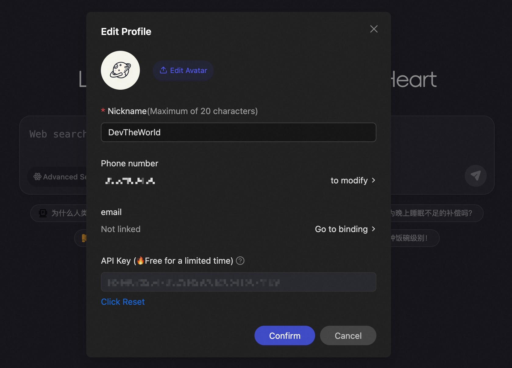

> [!IMPORTANT]
> **iFlow CLI cessera ses activités le 17 avril 2026 (UTC+8).** Merci d'avoir gardé iFlow CLI dans votre terminal. Pour plus de détails et le guide de migration, consultez notre [message d'adieu](https://vibex.iflow.cn/t/topic/4819).

---

# 🤖 iFlow CLI

[](https://github.com/Piebald-AI/awesome-gemini-cli)


[English](README.md) | [中文](README_CN.md) | [日本語](README_JA.md) | [한국어](README_KO.md) | **Français** | [Deutsch](README_DE.md) | [Español](README_ES.md) | [Русский](README_RU.md)

iFlow CLI est un assistant IA puissant qui s'exécute directement dans votre terminal. Il analyse de manière transparente les dépôts de code, exécute des tâches de programmation, comprend les besoins spécifiques au contexte et améliore la productivité en automatisant tout, des opérations simples sur les fichiers aux flux de travail complexes.

[Plus de Tutoriels](https://platform.iflow.cn/)

## ✨ Fonctionnalités principales

1. **Modèles IA gratuits** : Accédez à des modèles IA puissants et gratuits via la [plateforme ouverte iFlow](https://platform.iflow.cn/docs/api-mode), incluant Kimi K2, Qwen3 Coder, DeepSeek v3, et bien d'autres
2. **Intégration flexible** : Gardez vos outils de développement préférés tout en intégrant dans les systèmes existants pour l'automatisation
3. **Interaction en langage naturel** : Dites adieu aux commandes complexes, pilotez l'IA avec une conversation quotidienne, du développement de code à l'assistance personnelle
4. **Plateforme ouverte** : Installation en un clic de SubAgent et MCP depuis le [marché ouvert iFlow](https://platform.iflow.cn/), étendez rapidement les agents intelligents et construisez votre propre équipe IA

## Comparaison des fonctionnalités
| Fonctionnalité | iFlow Cli | Claude Code | Gemini Cli |
|----------------|-----------|-------------|------------|
| Planification Todo | ✅ | ✅ | ❌ |
| SubAgent | ✅ | ✅ | ❌ |
| Commandes personnalisées | ✅ | ✅ | ✅ |
| Mode plan | ✅ | ✅ | ❌ |
| Outils de tâche | ✅ | ✅ | ❌ |
| Plugin VS Code | ✅ | ✅ | ✅ |
| Plugin JetBrains | ✅ | ✅ | ❌ |
| Récupération de conversation | ✅ | ✅ | ❌ |
| Marché ouvert intégré | ✅ | ❌ | ❌ |
| Compression mémoire automatique | ✅ | ✅ | ✅ |
| Capacité multimodale | ✅ | ⚠️ (Modèles chinois non supportés) | ⚠️ (Modèles chinois non supportés) |
| Recherche | ✅ | ❌ | ⚠️ (VPN requis) |
| Gratuit | ✅ | ❌ | ⚠️ (Usage limité) |
| Hook | ✅ | ✅ | ❌ |
| Style de sortie | ✅ | ✅ | ❌ |
| Réflexion | ✅ | ✅ | ❌ |
| Flux de travail | ✅ | ❌ | ❌ |
| SDK | ✅ | ✅ | ❌ |
| ACP | ✅ | ✅ | ✅ |

## ⭐ Fonctionnalités clés
* Support de 4 modes de fonctionnement : yolo (modèle avec permissions maximales, peut exécuter n'importe quelle opération), accepting edits (modèle avec permissions de modification de fichiers uniquement), plan mode (planifier d'abord puis exécuter), default (modèle sans aucune permission)
* Fonctionnalité subAgent améliorée. Fait évoluer le CLI d'un assistant généraliste vers une équipe d'experts, vous fournissant des conseils plus professionnels et précis. Utilisez /agent pour voir plus d'agents préconfigurés
* Outil task amélioré. Compression efficace de la longueur du contexte, permettant au CLI d'accomplir vos tâches plus en profondeur. Compression automatique quand le contexte atteint 70%
* Intégration avec le marché ouvert iFlow. Installation rapide d'outils MCP utiles, de Subagents, d'instructions personnalisées et de flux de travail
* Utilisation gratuite de modèles multimodaux, vous pouvez également coller des images dans le CLI (Ctrl+V pour coller des images)
* Support de la sauvegarde et du retour en arrière de l'historique des conversations (commandes iflow --resume et /chat)
* Support de plus de commandes de terminal utiles (iflow -h pour voir plus de commandes)
* Support du plugin VSCode
* Mise à niveau automatique, iFlow CLI détecte automatiquement si la version actuelle est la plus récente


## 📥 Installation

### Configuration système requise
- Systèmes d'exploitation : macOS 10.15+, Ubuntu 20.04+/Debian 10+, ou Windows 10+ (avec WSL 1, WSL 2, ou Git for Windows)
- Matériel : 4GB+ de RAM
- Logiciel : Node.js 22+
- Réseau : Connexion Internet requise pour l'authentification et le traitement IA
- Shell : Fonctionne mieux avec Bash, Zsh ou Fish

### Commande d'installation
**Utilisateurs MAC/Linux/Ubuntu** :
* Commande d'installation en un clic (Recommandée)
```shell
bash -c "$(curl -fsSL https://cloud.iflow.cn/iflow-cli/install.sh)"
```
* Installation avec Node.js
```shell
npm i -g @iflow-ai/iflow-cli
```

Cette commande installe automatiquement toutes les dépendances nécessaires pour votre terminal.

**Utilisateurs Windows**:
1. Allez sur https://nodejs.org/fr/download pour télécharger le dernier installateur Node.js
2. Exécutez l'installateur pour installer Node.js
3. Redémarrez votre terminal : CMD ou PowerShell
4. Exécutez `npm install -g @iflow-ai/iflow-cli` pour installer iFlow CLI
5. Exécutez `iflow` pour démarrer iFlow CLI

Si vous êtes en Chine continentale, vous pouvez utiliser la commande suivante pour installer iFlow CLI :
1. Allez sur https://cloud.iflow.cn/iflow-cli/nvm-setup.exe pour télécharger le dernier installateur nvm
2. Exécutez l'installateur pour installer nvm
3. **Redémarrez votre terminal : CMD ou PowerShell**
4. Exécutez `nvm node_mirror https://npmmirror.com/mirrors/node/` et `nvm npm_mirror https://npmmirror.com/mirrors/npm/`
5. Exécutez `nvm install 22` pour installer Node.js 22
6. Exécutez `nvm use 22` pour utiliser Node.js 22
7. Exécutez `npm install -g @iflow-ai/iflow-cli` pour installer iFlow CLI
8. Exécutez `iflow` pour démarrer iFlow CLI

## 🗑️ Désinstallation
```shell
npm uninstall -g @iflow-ai/iflow-cli
```

## 🔑 Authentification

iFlow propose deux options d'authentification :

1. **Recommandé** : Utiliser l'authentification native d'iFlow
2. **Alternative** : Se connecter via des API compatibles OpenAI


Choisissez l'option 1 pour vous connecter directement, ce qui ouvrira l'authentification du compte iFlow dans une page web. Après avoir terminé l'authentification, vous pouvez l'utiliser gratuitement.


Si vous êtes dans un environnement comme un serveur où vous ne pouvez pas ouvrir une page web, utilisez l'option 2 pour vous connecter.

Pour obtenir votre clé API :
1. Créez un compte iFlow
2. Allez dans les paramètres de votre profil ou cliquez sur [ce lien direct](https://iflow.cn/?open=setting)
3. Cliquez sur "Reset" dans la boîte de dialogue pour générer une nouvelle clé API



Après avoir généré votre clé, collez-la dans l'invite du terminal pour terminer la configuration.

## 🚀 Prise en main

Pour lancer iFlow CLI, naviguez vers votre espace de travail dans le terminal et tapez :

```shell
iflow
```

### Démarrer de nouveaux projets

Pour de nouveaux projets, décrivez simplement ce que vous voulez créer :

```shell
cd nouveau-projet/
iflow
> Créer un jeu Minecraft basé sur le web en utilisant HTML
```

### Travailler avec des projets existants

Pour des bases de code existantes, commencez par la commande `/init` pour aider iFlow à comprendre votre projet :

```shell
cd projet1/
iflow
> /init
> Analyser les exigences selon le document PRD dans le fichier requirement.md, et produire un document technique, puis implémenter la solution.
```

La commande `/init` scanne votre base de code, apprend sa structure et crée un fichier IFLOW.md avec une documentation complète.

Pour une liste complète des commandes slash et des instructions d'utilisation, voir [ici](./i18/en/commands.md).

## 💡 Cas d'usage courants

iFlow CLI va au-delà du codage pour gérer une large gamme de tâches :

### 📊 Information et planification

```text
> Aide-moi à trouver les restaurants les mieux notés à Los Angeles et créer un itinéraire de tour gastronomique de 3 jours.
```

```text
> Rechercher les dernières comparaisons de prix d'iPhone et trouver l'option d'achat la plus rentable.
```

### 📁 Gestion de fichiers

```text
> Organiser les fichiers de mon bureau par type de fichier dans des dossiers séparés.
```

```text
> Télécharger en lot toutes les images de cette page web et les renommer par date.
```

### 📈 Analyse de données

```text
> Analyser les données de vente dans cette feuille de calcul Excel et générer un graphique simple.
```

```text
> Extraire les informations client de ces fichiers CSV et les fusionner dans un tableau unifié.
```

### 👨‍💻 Support de développement

```text
> Analyser les principaux composants architecturaux et les dépendances de modules de ce système.
```

```text
> J'obtiens une exception de pointeur null après ma requête, aide-moi à trouver la cause du problème.
```

### ⚙️ Automatisation de flux de travail

```text
> Créer un script pour sauvegarder périodiquement mes fichiers importants vers le stockage cloud.
```

```text
> Écrire un programme qui télécharge les prix des actions quotidiennement et m'envoie des notifications par email.
```

*Note : Les tâches d'automatisation avancées peuvent exploiter les serveurs MCP pour intégrer vos outils système locaux avec les suites de collaboration d'entreprise.*

## 🔧 Basculer vers un modèle personnalisé

iFlow CLI peut se connecter à n'importe quelle API compatible OpenAI. Modifiez le fichier de paramètres dans `~/.iflow/settings.json` pour changer le modèle que vous utilisez.

Voici un exemple de fichier de paramètres :
```json
{
    "theme": "Default",
    "selectedAuthType": "iflow",
    "apiKey": "votre clé iflow",
    "baseUrl": "https://apis.iflow.cn/v1",
    "modelName": "Qwen3-Coder",
    "searchApiKey": "votre clé iflow"
}
```

## 🔄 GitHub Actions

Vous pouvez également utiliser iFlow CLI dans vos workflows GitHub Actions avec l'action maintenue par la communauté : [iflow-cli-action](https://github.com/iflow-ai/iflow-cli-action)

## 👥 Communication Communautaire
Si vous rencontrez des problèmes lors de l'utilisation, vous pouvez directement créer des Issues sur la page GitHub.

Vous pouvez également scanner le code QR du groupe WeChat suivant pour rejoindre le groupe communautaire pour la communication et la discussion.

### Groupe WeChat

